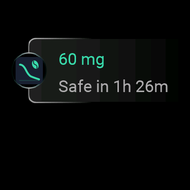
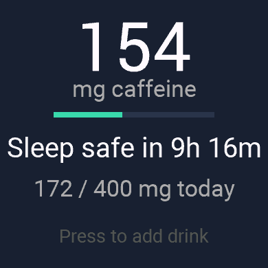
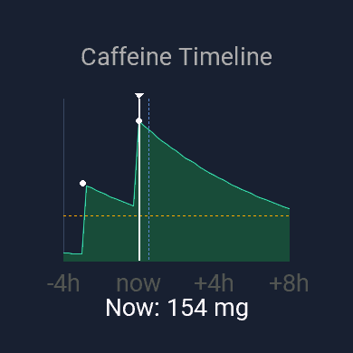
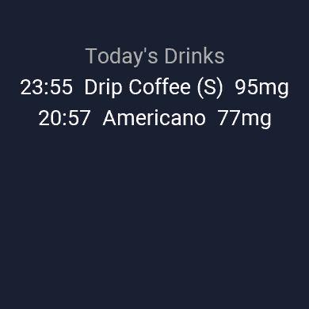
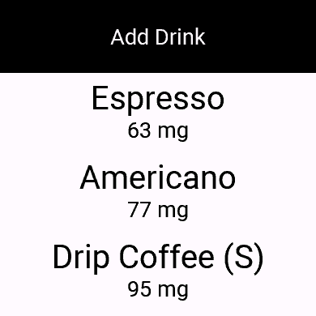

# HalfLife Caffeine

A free Garmin Connect IQ widget that tracks caffeine intake and models its decay using the established 5.7-hour pharmacokinetic half-life, so you always know how much caffeine is still active — and when you'll be safe to sleep.

<p align="center">
  
  
  
</p>
<p align="center">
  
  
</p>

## Features

- **Glance view** — current caffeine level and time-to-sleep-safe at a glance in the widget loop
- **Summary screen** — large mg display, progress bar toward daily limit, intake vs. limit, time-to-safe
- **Timeline graph** — 12-hour window (4h past + 8h future) with dose markers, area fill, bedtime marker, and a prominent NOW indicator
- **Today's log** — every drink you've logged today
- **12 drink presets** — Espresso, Americano, Drip Coffee (S/L), Latte, Green Tea, Black Tea, Red Bull, Monster, Cola, Dark Chocolate, Pre-Workout
- **Daily limit alerts** — gentle vibration at 80%, stronger alert at 100%
- **Safe-to-sleep notification** — fires when caffeine drops below 50 mg within 2 hours of your bedtime
- **Phone companion** — manage presets, adjust limits and bedtime, view history and trends inside the Garmin Connect app
- **Two-way sync** — drinks stream to the phone; settings and preset edits stream back to the watch
- **100% free, no ads, no tracking, no accounts** — all data stays on your watch and phone

## Install

**From the Connect IQ Store** *(link will be added after review approval)*

**Sideload the pre-built release**
1. Download the latest `.iq` or `.prg` from the [Releases page](https://github.com/jame581/HalfLifeCaffeine/releases)
2. Connect your watch via USB
3. Copy the `.prg` to `GARMIN/APPS/`
4. Disconnect and find the widget in your widget loop

## Supported Devices

Vivoactive 4/5, Venu 2 / 2 Plus / 2s / 3 / 3s, Forerunner 955 / 965, Fenix 6 / 6s / 6 Pro / 6x Pro / 7 / 7s / 7x, Epix 2, and related devices. Requires Connect IQ API 3.2+ (for glance views).

## Development

### Prerequisites
- [Connect IQ SDK 9.1+](https://developer.garmin.com/connect-iq/sdk/)
- VS Code with the Monkey C extension
- A developer key (`openssl genrsa -out private_key.pem 4096 && openssl pkcs8 -topk8 -inform PEM -outform DER -in private_key.pem -out private_key.der -nocrypt`)

### Build & run
VS Code: **Run → Run App** (select target device from the list).

CLI:
```bash
monkeyc -f monkey.jungle -d vivoactive5_sim -y path/to/developer_key -o bin/CoffeTracker.prg -w
```

### Release build (all devices)
```bash
monkeyc -e -f monkey.jungle -y path/to/developer_key -o bin/HalfLifeCaffeine.iq
```

### Run tests
`(:test)` annotated functions in `test/` — execute via **Run → Run Tests** in VS Code.

## Project Layout

```
source/            Monkey C source
├── HalfLifeCaffeineApp.mc   Entry point, manager wiring
├── CaffeineModel.mc          Decay math and projections
├── StorageManager.mc         Persistence layer
├── DrinkPresets.mc           Preset list (defaults + phone sync)
├── AlertManager.mc           Daily limit and sleep notifications
├── SyncManager.mc            Phone companion sync
├── Util.mc                   Formatting helpers
├── Colors.mc                 Palette constants
├── GlanceView.mc             At-a-glance view
├── SummaryView.mc            Main screen
├── TimelineView.mc           Graph
├── LogView.mc                Today's drinks list
└── ...Delegate.mc            Input handlers

resources/
├── drawables/     Launcher icon (SVG) + drawables.xml
├── properties.xml User setting defaults
├── settings.xml   Garmin Connect settings UI
└── strings.xml    Localizable strings

companion/
└── settings/      HTML/JS phone companion (runs inside Garmin Connect)

test/              Monkey C unit tests

docs/
├── superpowers/   Design spec and implementation plan
└── store-listing.md  Draft store copy
```

See [`CLAUDE.md`](CLAUDE.md) for deeper architecture notes (glance vs. full-view process split, persistence conventions, message protocol, domain invariants).

## Caffeine Model

- **Half-life:** 5.7 hours (`CaffeineModel.HALF_LIFE_SECONDS = 20520`)
- **Formula:** `current_mg = dose_mg × 0.5^(elapsed_seconds / 20520)`
- **Sleep-safe threshold:** 50 mg
- **Default daily limit:** 400 mg (FDA guideline; user-configurable)
- **Retention:** 14 days of dose history on the watch

## Contributing

Issues and PRs welcome. If you're adding a feature, keep in mind:
- New classes reachable from the glance view need the `(:glance)` annotation
- Dictionary values do not round-trip through `Application.Storage`; serialize to arrays (see `StorageManager.saveDoses`)
- Follow the existing manager pattern — add managers in `HalfLifeCaffeineApp.initializeManagers()` and persist in `onStop` if their state is in-memory only

## License

MIT

## Credits

Built with the [Connect IQ SDK](https://developer.garmin.com/connect-iq/).
